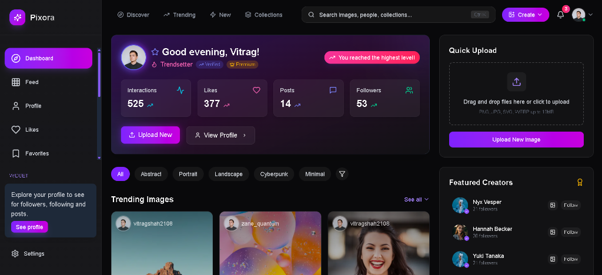
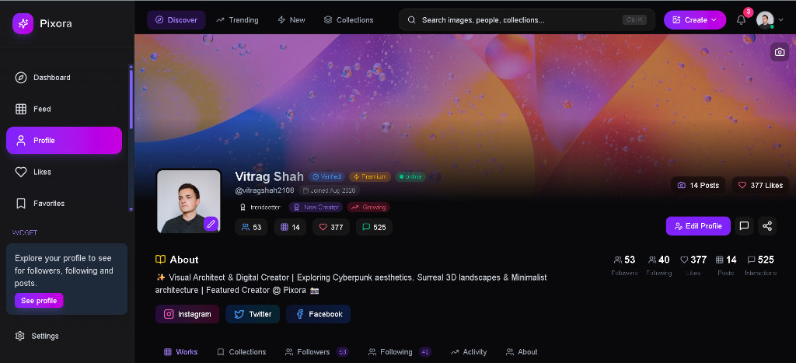

# 📸 Pixora — Full-Stack Creative Visual Discovery Platform

<div align="center">

[](https://pixora-hub.vercel.app/)
[](https://nextjs.org/)
[](https://reactjs.org/)
[](https://nodejs.org/)
[](https://www.mongodb.com/)
[](https://cloudinary.com/)
[](https://tailwindcss.com/)

<br />

**🚀 Live Website:** **[https://pixora-hub.vercel.app](https://pixora-hub.vercel.app)**

**Crafted with passion by [Vitrag Shah](https://github.com/Vitragshah2108)**

[🌟 Explore Live Demo](https://pixora-hub.vercel.app/) • [⚡ Quick Demo Access](#-quick-demo-access) • [📸 Platform Previews](#-platform-showcase) • [📖 Features](#-core-features)

</div>

---

## ⚡ Quick Demo Access

Explore the complete live platform with all features unlocked using the pre-seeded demo creator credentials:

| Key | Demo Credential |
|---|---|
| **🌐 Live URL** | **[https://pixora-hub.vercel.app](https://pixora-hub.vercel.app)** |
| **👤 Username** | `pixora_demo` |
| **📧 Email** | `demo@pixora.io` |
| **🔑 Password** | `Test@123` |

> 💡 *Or create your own account via Email / Password registration or instant Google Sign-In.*

---

## 📸 Platform Showcase

### 📊 Creator Dashboard & Community Feed


### 👤 Creator Profile, Works & Social Badging


---

## 🌟 Overview

**Pixora** is a state-of-the-art creative social platform and visual discovery hub engineered for photographers, digital artists, 3D renderers, and visual curators. 

Built with **Next.js 15 (App Router)**, **Tailwind CSS**, **Node.js/Express**, and **MongoDB Atlas**, Pixora delivers an engaging photography ecosystem with fluid masonry feeds, cloud media management with Cloudinary CDN, moodboard collections, social interactions, automated password recovery via Nodemailer, and real-time creator analytics.

---

## 🎯 Key Highlights

- **⚡ Blazing Fast Next.js 15**: Edge-optimized App Router with serverless route handlers and zero-latency image proxying.
- **🎨 Glassmorphic Dark UI**: Custom-tailored dark theme with sleek gradients, smooth micro-animations, and fluid responsive design.
- **☁️ Cloudinary CDN Media Pipeline**: Direct signed cloud uploads, automatic image compression, multi-resolution transformations, and high-speed delivery.
- **🔒 Robust Dual Authentication**: Credentials authentication with Bcrypt hashing alongside Google OAuth via NextAuth.
- **📧 Password Recovery**: Automated password reset flow powered by Nodemailer and cryptographic token generation.
- **📁 Curated Collections**: Public and private mood boards and albums for categorizing visual inspirations.
- **💬 Social Engagement**: Real-time likes, favorites/bookmarks, threaded comments, follower network, and in-app notifications.
- **📊 Creator Analytics & Prestige Badges**: Milestone achievement badges (*Newbie*, *Rising*, *Pro*, *Trendsetter*), interaction score tracking, and cloud storage monitoring.

---

## 🚀 Core Features

### 1. 🖼️ Visual Discovery & Masonry Feed
- **Dynamic Masonry Layout**: Responsive grid showcasing community visual artwork.
- **Multi-Factor Search**: Instant search by keywords, categories, aesthetic tags, and creator usernames.
- **Rich Image Modals**: High-resolution previews, color palettes, EXIF metadata, tags, and creator info.

### 2. 📤 Image Upload & Cloud Media Storage
- **Direct Cloudinary Pipeline**: Signed cloud uploads with title, caption, tags, category tagging, and privacy controls.
- **Auto-Optimization**: Automatic format conversion (WebP/AVIF), responsiveness, and CDN edge caching.

### 3. 📁 Collections & Moodboards
- **Custom Curated Albums**: Organize images into personal or public collections (e.g., *Cyberpunk*, *Minimalist Architecture*, *Portraits*).
- **One-Click Save**: Add to existing or new collections directly from feeds and image details.

### 4. 💬 Community & Social Interaction
- **Likes & Favorites Vault**: Express appreciation or save visuals to your private bookmarks.
- **Threaded Discussions**: Post reviews, ratings, and threaded comments on images.
- **Follow Network**: Follow fellow artists to customize your personal feed.
- **Notification Hub**: Real-time alerts for likes, comments, and new followers.

### 5. 👤 Creator Portfolio & Milestone Badges
- **Custom Profiles**: Personalize avatars, cover banners, bios, and external social media links (Instagram, Twitter/X, Facebook).
- **Prestige Milestone Badges**:
  - 🟢 **Newbie** — Starter creator badge
  - 🔵 **Rising** — Active creator (*posts > 4*)
  - 🟣 **Pro** — Established photographer (*followers > 49*)
  - 🟡 **Trendsetter** — Community favorite (*likes > 100*)

### 6. 📊 Creator Dashboard & Analytics
- **Live Metrics**: Total views, likes received, followers, interaction score, and cloud storage quota.

---

## 🛠️ Technology Stack

| Layer | Technologies |
|---|---|
| **Frontend** | Next.js 15 (App Router), React 19, Tailwind CSS, Framer Motion, Lucide Icons, Axios |
| **Backend** | Node.js, Express.js, Mongoose (MongoDB ODM), Nodemailer, Multer |
| **Database** | MongoDB Atlas Cloud Database |
| **Media CDN** | Cloudinary (Signed Uploads, Image Optimization, CDN delivery) |
| **Authentication** | NextAuth.js, JWT, Bcrypt.js, Google OAuth 2.0 |
| **Email Service** | Nodemailer (Gmail / SMTP Protocol) |
| **Deployment** | Vercel (Frontend & Backend Serverless Functions) |

---

## 📁 Repository Structure

```
Pixora/
├── backend/
│   ├── api/                 # Vercel serverless entrypoint
│   ├── src/
│   │   ├── config/          # Database & Cloudinary configurations
│   │   ├── controllers/     # Route controllers (users, images, collections, etc.)
│   │   ├── middlewares/     # Authentication & Multer upload middlewares
│   │   ├── models/          # Mongoose schemas (User, Image, Collection, Review, etc.)
│   │   ├── routes/          # Express API route endpoints
│   │   └── utils/           # Nodemailer, ApiResponse, and ApiError handlers
│   ├── vercel.json          # Backend serverless routing config
│   └── package.json
├── frontend/
│   ├── public/              # Static assets, icons, and screenshots
│   ├── src/
│   │   ├── app/             # Next.js 15 App Router pages & API routes
│   │   ├── components/      # UI components, modals, headers, sidebars
│   │   ├── context/         # AuthContext & global React state providers
│   │   ├── hooks/           # Custom React hooks (useApi, useFollow, etc.)
│   │   └── lib/             # API client utilities & Axios instances
│   ├── next.config.mjs
│   └── package.json
├── screenshots/             # Real platform screenshots
├── .gitignore
└── README.md
```

---

## 💻 Local Development Setup

### Prerequisites
- Node.js (v18 or higher)
- npm or yarn
- MongoDB Atlas database URI
- Cloudinary credentials

### 1. Clone the Repository
```bash
git clone https://github.com/Vitragshah2108/pixora.git
cd pixora
```

### 2. Backend Setup
```bash
cd backend
npm install
npm run dev
```

### 3. Frontend Setup
```bash
cd ../frontend
npm install
npm run dev
```

Open [http://localhost:3000](http://localhost:3000) in your browser to view the application locally.

---

## 👨‍💻 Author

**Vitrag Shah**
- **GitHub:** [@Vitragshah2108](https://github.com/Vitragshah2108)
- **Email:** vitragshah2108@gmail.com
- **Live Project:** [https://pixora-hub.vercel.app](https://pixora-hub.vercel.app)

---

## 📄 License

This project is licensed under the [MIT License](LICENSE).
